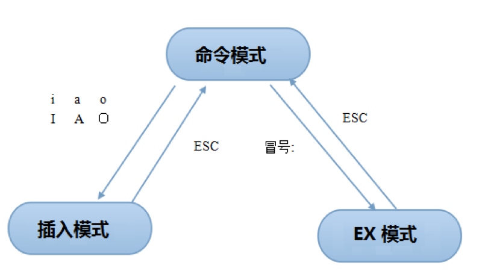

# Vim
## Vim介绍
* 编辑文本文件是系统管理员在Linux系统上执行的一项最为常见的任务。因此，有各式各样的文本编辑器可以选用，最有代表的应当是vi和emacs，本人常用vi，所以这里也就说说vi的应用。
* CnetOS7 中的vim代表vi的增强版，因此vim具有许多vi中没有的功能，但依然保持向后兼容性。在新的功能中包含了广受欢迎的选项，如语法突出显示，不全模式和拼写检查等。
* Vim是高度可扩展的. 它支持多语言脚本、文件类型插件、各种文本补全模式、以及许多其他选项。它可以适应几乎任何角色。

## 为什么要掌握vim？
* 每个系统管理员对于编辑器都有不同的偏爱，一些人会选择gedit，有些人会选择nano，甚至还有人选用emacs，既然已经有可选的编辑器了，那么也要熟悉下vim和vi的基本知识，原因很简单，随系统安装，适用广泛，shell下必备编辑器。

## Vim切换模式
* Vim并不是容易学习的编辑器，其部分原因是vim中的所有命令都以速度和效率为目标而设计的，不容易记忆，另一部分原因在于vim是模态编辑器，模态编辑器意味着特定命令和按键操作的功能取决于当前活动状态是什么模式。

##### Vim三种主要模式状态：
- 命令模式
    -   此模式用于文本导航，剪切和粘贴以及简单命令。撤销，恢复和其他操作也从此模式中执行
- 插入模式
    -   此模式用于常规文本编辑。替换模式是插入模式的一种变体，可以替换而不是插入文本。
- EX模式
    -   此模式用于保存，退出和打开文件，以及搜索，替换和其他更为复杂的操作。此模式中，可以将程序的输出插入到当前文件中，以及配置vim等等。使用ex可以实现的所有功能都可以从此模式执行。

