## log，log，还是log.
#### Rsyslog介绍
1、直接将日志写入到数据库。
2、日志队列（内存队列和磁盘队列）。
3、灵活的模板机制，可以得到多种输出格式。
4、插件式结构，多种多样的输入、输出模块。
5、可以把日志存放在Mysql ，PostgreSQL，Oracle等数据库中

#### 系统日志
进程和操作系统内核需要能够为发生的事件记录日志。这些日志可用于系统审核和问题的故障排除，默认存储在”/var/log”目录中。
CentOS7中内建了一个基于系统日志协议的标准日志记录系统。许多程序使用此系统记录事件，并整理到日志文件中，CentOS7 中的系统日志消息由2个服务负责处理，分别是 systemd-journald 和 rsyslog.
|名称|释义|
|:--|:--|
|Systemd-journald|该守护进程提供一种改进的日志管理服务，可以收集来自内核，启动过程的早期阶段，标准输出，系统日志，以及守护进程启动和运行期间错误的消息。系统日志消息可以由systemd-journald转到rsyslog做进一步处理。|
|Rsyslog|该服务随后根据类型或者设备类型以及优先级排列系统日志消息，写入/var/log/目录内的文件中|
|/var/log|该目录保管由rsyslog维护的各种特定于系统和服务的日志文件.|

#### 常用系统日志文件
|日志文件|作用|
|:---|:---|
|/var/log/messages|记录系统日志消息，大多数的系统信息和服务启动系统都记录在这里|
|/var/log/secure|安全和身份验证的消息|
|/var/log/maillog|与邮件服务器相关的日志信息|
|/var/log/cron|Crontab定期执行任务的相关日志|
|/var/log/boot.log|与系统启动相关的日志|

#### 日志级别
|序号|优先级|严重性|
|:--|:--|:--|
|0|Emerg|系统不可用|
|1|Alert|必须立刻采取措施|
|2|Crit|严重情况|
|3|Err|非严重错误|
|4|Warning|警告状态|
|5|Notice|正常但是重要的事件|
|6|Info|普通信息事件|
|7|Debug|调试级别信息|

#### 配置文件
Rsyslogd服务的配置文件在”/etc/rsyslog.conf”文件，以及”/etc/rsyslog.d”中的*.conf文件进行配置。可以讲自定义的带有.conf后缀的文件放入/etc/rsyslog.d目录，可以更改rsyslogd配置不被rsyslog更新覆盖。
/etc/rsyslog.conf的#######RULES#######部分包含定义日志消息配置，范例如下：

```
#### RULES ####

# Log all kernel messages to the console.
# Logging much else clutters up the screen.
#kern.*                                                 /dev/console
关于内核的所有日志都放到/dev/console(控制台)

# Log anything (except mail) of level info or higher.
# Don't log private authentication messages!
*.info;mail.none;authpriv.none;cron.none                /var/log/messages
记录所有日志类型的info级别以及大于info级别的信息到/var/log/messages，但是mail邮件信息，authpriv验证方面的信息和cron时间任务相关的信息除外

# The authpriv file has restricted access.
authpriv.*                                              /var/log/secure
authpriv验证相关的所有信息存放在/var/log/secure
# Log all the mail messages in one place.
mail.*                                                  -/var/log/maillog
邮件的所有信息存放在/var/log/maillog; 这里有一个-符号, 表示是使用异步的方式记录, 因为日志一般会比较大

# Log cron stuff
cron.*                                                  /var/log/cron
计划任务有关的信息存放在/var/log/cron

# Everybody gets emergency messages
*.emerg                                                 :omusrmsg:*
记录所有的大于等于emerg级别信息, 以wall方式发送给每个登录到系统的人

# Save news errors of level crit and higher in a special file.
uucp,news.crit                                          /var/log/spooler
记录uucp,news.crit等存放在/var/log/spooler
# Save boot messages also to boot.log
local7.*                                                /var/log/boot.log
启动的相关信息
相关格式：
———————————————————————-
日志设备(类型).(连接符号)日志级别   日志处理方式(action)
日志设备(可以理解为日志类型):
———————————————————————-
auth        –pam产生的日志
authpriv    –ssh,ftp等登录信息的验证信息
cron        –时间任务相关
kern        –内核
lpr         –打印
mail        –邮件
mark(syslog)–rsyslog服务内部的信息,时间标识
news        –新闻组
user        –用户程序产生的相关信息
uucp        –unix to unix copy, unix主机之间相关的通讯
local 1~7   –自定义的日志设备
```

#### 日志格式
```
#cat /var/log/messages
……
Oct 26 15:30:29 centos7 systemd: Started Session 3 of user root.
Oct 26 15:30:29 centos7 systemd-logind: New session 3 of user root.
……..
```
```
#cat /var/log/secure
Oct 26 15:30:29 centos7 sshd[4185]: Accepted password for root from 192.168.56.1 port 49867 ssh2
Oct 26 15:30:29 centos7 sshd[4185]: pam_unix(sshd:session): session opened for user root by (uid=0)
```
>上文2个范例说明日志格式：时间戳：主机名：应用名：事件内容

#### 自定义日志

如果你需要记录的是单机的日志，可以直接在rsyslog.conf中修改，然后添加相对应的内容即可，或者是以.conf为后缀的配置文件存放到/etc/rsyslog.d/下。
例如我们添加认证的alert级别的信息，可以执行如下操作：
```
echo "authpriv.alert  /var/log/auth-errors" > /etc/rsyslog.d/auth-errors.conf
systemctl restart rsyslog
logger -p authpriv.alert "test auth error"
将会在/var/log/auth-errors中看见如下
Oct 26 16:38:11 centos7 root: test auth error
```

#### 其他rsyslog.conf选项
rsyslog 能在内存被占满时将日志队列放到磁盘。磁盘辅助队列使日志的传输更可靠。如何配置rsyslog 的磁盘辅助队列：
```
$WorkDirectory /var/spool/rsyslog #暂存文件（spool）放置位置
$ActionQueueFileName fwdRule1     #暂存文件的唯一名字前缀
$ActionQueueMaxDiskSpace 1g#1gb空间限制（尽可能大）
$ActionQueueSaveOnShutdown on     #关机时保存日志到磁盘
$ActionQueueType LinkedLis t#异步运行
$ActionResumeRetryCount -1#如果主机宕机，不断重试
```

#### 小结
以上为日志的基础内容，了解以上内容之后我们可以进行下面的内容来深入配置日志和分析日志。

## 日志轮转

#### Logrorate介绍
所有的日志文件都会随着时间的推移和访问次数的增加而迅速增长，所以需要对日志文件进行定期清理，避免不必要的磁盘空间浪费，也加快了管理员查看日志所用的时间。这时候logrotate就非常有存在的必要了，CentOS 7系统中默然安装logrotate并且利用logrotate设置了相关对rsyslog日志增长的设置。
Logrotate的工作是由crontab来定时执行，定时执行文件在/etc/cron.daily/logrotate，
实际上就是一个启动logrotate的脚本，由crontab每天启动。
logrorate配置文件在/etc/logrotate.conf 
```
[root@centos7 rsyslog.d]# cat /etc/cron.daily/logrotate 
#!/bin/sh
/usr/sbin/logrotate /etc/logrotate.conf
…….
exit 0
```

#### Logrorate配置文件
```
[root@centos7 rsyslog.d]#  sed -e '/^#/d'  -e '/^$/d' /etc/logrotate.conf
weekly      #每周清理一次日志文件
rotate 4    #保存四个轮换日志
create      #清除旧日志的同时，创建新的空日志文件
dateext     #使用日期为后缀的回滚文件 
include /etc/logrotate.d  #包含/etc/logrotate.d目录下的所有配置文件
/var/log/wtmp {      #对/var/log/wtmp这个日志文件按照下面的设定日志回滚
    monthly                    #每月轮转一次
    create 0664 root utmp      #设置wtmp这个日志文件的权限，属主，属组
    minsize 1M                 #日志文件必须大于1M才会去轮换(回滚）
    rotate 1                   #保存一个轮换日志
}
……
```

#### Logrorate.d的模块配置文件
```
[root@centos7 logrotate.d]# ls
chrony  glusterfs  iscsiuiolog  libvirtd.qemu  ppp     samba  syslog          yum
cups    httpd      libvirtd     numad          psacct  sssd   wpa_supplicant
可以看到系统已经定义好了很多日志的轮转
[root@centos7 logrotate.d]# cat syslog 
/var/log/cron
/var/log/maillog
/var/log/messages
/var/log/secure
/var/log/spooler
…….
这些定义的文件是rsyslog.conf文件中全局配置定义中指定的文件
```

#### Logrorate.d自定义配置
有时候我们安装某些应用可能会产生大量的日志，但是logrorate没有默认的规则适应，所以我们需要自定义一些logrorate的自定义文件，以nginx为例：

```
#vim /etc/logrotate.d/nginx
/usr/local/nginx/logs/*.log {  //需要轮询日志路径
daily   //每天轮询   
rotate 5  //保留最多5次滚动的日志
missingok  //如果日志丢失，不报错继续滚动下一个日志
dateext    //使用日期作为命名格式
compress   //通过gzip压缩转储以后的日志
notifempty  //当日志为空时不进行滚动
sharedscripts
postrotate   //在截断转储以后需要执行的命令
[ -e /var/run/nginx.pid ] && kill -USR1 `cat /var/run/nginx.pid` ]
//nginx pid位置,定义在nginx.conf
endscript
}
//如果需要立刻截断可以使用如下命令：
/usr/sbin/logrotate -f /etc/logrotate.d/nginx
```

## 集中日志服务器
但是，生产环境中我们拥有N，N，N多台主机，不可能要看日志的时候每个主机单独去查看，这样会累死的。所以我们都会将相关的日志收集到一台服务器上进行查看，这种做法rsyslog服务也是天生支持集中日志模式，所以好好利用一下，将大大简化你的工作强度。

#### 集中服务器架构图
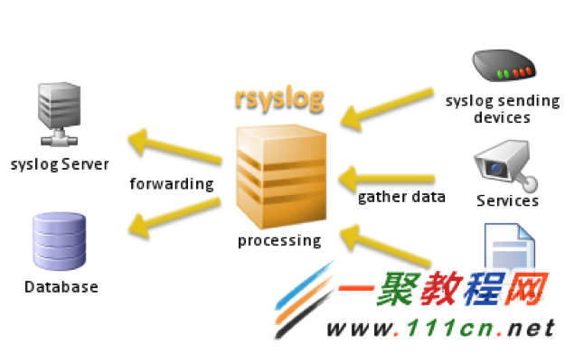

#### Server端
打开tcp传输和udp传输接收，编辑如下文件，去掉下面4行的注释.
解释：
Tcp传输使用 @@
Udp传输使用 @
```
#vim /etc/rsyslog.conf  

$ModLoad imudp
$UDPServerRun 514

$ModLoad imtcp
$InputTCPServerRun 514
```
配置文件中找到如下区域，添加如下行。
解释：
$template RemoteLogs，“RemoteLogs” 描述性名称后续可以直接调用该模板（可以更改），模板是在/var/log/下以主机名为单位命名文件夹，然后以服务名称记录log。

符号"& ~"表示了一个重定向规则，告诉rsyslog守护进程停止对日志消息的进一步处理，同时不要在本地写入。如果没有这个重定向规则，那么所有的远程日志都会在写入上述描述的日志文件之外同时又被写入到本地日志文件，这就意味着日志消息实际上被写了两次。
```
#### GLOBAL DIRECTIVES ####   //区域
$template RemoteLogs,"/var/log/%HOSTNAME%/%PROGRAMNAME%.log" *
*.* ?RemoteLogs
& ~
```
配置文件中找到如下区域，添加如下行。  可以注释掉原有的本地信息即可，写你需要记录并且收集的日志。
```
#### RULES #### //区域

# Log all kernel messages to the console.
# Logging much else clutters up the screen.
#kern.*                                                 /dev/console
# Log anything (except mail) of level info or higher.
# Don't log private authentication messages!
*.info,mail.none,authpriv.none,cron.none 		?RemoteLogs
#*.info;mail.none;authpriv.none;cron.none                /var/log/messages
# The authpriv file has restricted access.
#authpriv.*                                              /var/log/secure
authpriv.*                                              ?RemoteLogs
# Log all the mail messages in one place.
mail.*                                                  -/var/log/maillog
# Log cron stuff
#cron.*                                                  /var/log/cron
cron.*                                                  ?RemoteLogs
```
重启rsyslog
```
systemctl restart rsyslog.service
```
验证端口启动
```
[root@localhost ~]# netstat -an | grep :514
tcp        0      0 0.0.0.0:514             0.0.0.0:*               LISTEN     
tcp        0      0 192.168.56.101:514      192.168.56.66:57748     ESTABLISHED   
udp        0      0 0.0.0.0:514             0.0.0.0:*                          
```

#### 客户端
```
#vim /etc/rsyslog.conf   修改如下格式
# ### begin forwarding rule ###   //区域
……
# remote host is: name/ip:port, e.g. 192.168.0.1:514, port optional
*.* @@192.168.56.101:514
```
重启rsyslog
```
systemctl restart rsyslog.service
```

#### 验证传输
在客户端随意重新启动一个服务或者ssh连接都可以在服务器上”/var/log/主机名/服务.log”
```
[root@localhost centos7]# pwd
/var/log/centos7
[root@localhost centos7]# ls
CROND.log  rsyslogd.log  sshd.log  systemd.log  systemd-logind.log
```

### 小结

是不是觉得轻快不少了啊，但是这里有一个弊端，就是如果生产机器非常多，要么你在服务端使用SSD或者内存盘来加速读写同时使用双万兆网卡避开网络瓶颈，要不然~~~~！！所有服务器一起写日志的时候就是你的死期！
我的生产环境机器非常多，所以不可能使用全部集中的格式，只能按照区域或者项目多组建几个服务器，每天让各个系统的管理员去查看自己的日志。
但是这个是最后的解放方案么？这些管理员要是能把所管机器日志都看一遍，那也就是神了。所以还要继续深入，然后进行使用日志分析工具来进行分析。

## 日志入库
让mysql数据库和rsyslog进行连接，日志直接写入数据库，然后使用日志分析工具进行分析，简化管理员工作量。

#### 基础环境配置

1.	安装基础环境
```
安装 LAMP 环境和rsyslog的数据库插件
# yum -y install httpd php*
# yum groupinstall mariadb mariadb-client –y
# yum –y install rsyslog-mysql
```
2.	启动mariadb
```
#systemctl start mariadb
#systemctl enable mariadb
```
3.	确定mariadb启动成功
```
#netstat –an |grep 3306
```
4.	配置数据库
```
#mysqladmin -u root password 123456  //设置密码
[root@centos7 ~]# mysql -u root –p    //登录并查看当前数据库，q退出
Enter password: 
…….
MariaDB [(none)]> show databases;
+--------------------+
| Database           |
+--------------------+
| information_schema |
| mysql              |
| performance_schema |
| test               |
+--------------------+
4 rows in set (0.00 sec)
```
5.	初始化日志数据库
```
[root@centos7 doc]# cd /usr/share/doc/rsyslog-mysql-7.4.7/
[root@centos7 rsyslog-mysql-7.4.7]# mysql -u root -p < createDB.sql 
Enter password: 
```
6.	验证导入sql
```
[root@centos7 rsyslog-mysql-7.4.7]# mysql -u root -p
Enter password: 
…….
MariaDB [(none)]> show databases;
……

MariaDB [(none)]> use Syslog;
……
Database changed

MariaDB [Syslog]> show tables ;
+------------------------+
| Tables_in_Syslog       |
+------------------------+
| SystemEvents           |
| SystemEventsProperties |
+------------------------+
```
7.	数据库授权
```
MariaDB [(none)]> grant all on Syslog.* to rsyslog@localhost identified by '123456';
MariaDB [(none)]>flush privileges;  //重读授权表，即时生效
```
8.	验证LAMP环境
```
[root@centos7 ~]# systemctl restart httpd.service;systemctl enable httpd.service

编写PHP探针页面

[root@localhost contrib]# cd /var/www/html/
[root@localhost html]# cat index.php 
<?php
phpinfo();
?>
```
9. 访问http://IP/index.php,出现如下界面即可，并查找Mysql支持
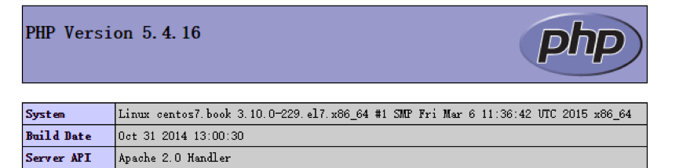
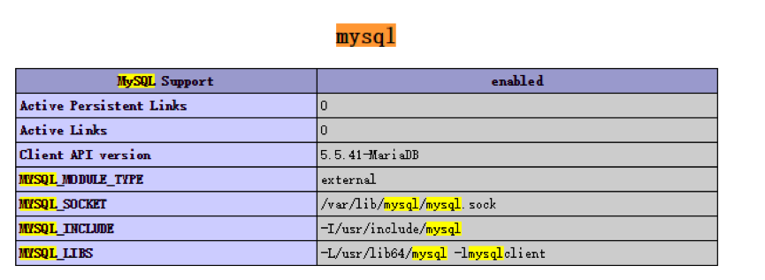

### 日志服务器配置
```
编辑配置文件/etc/rsyslog.conf修改如下
#### MODULES ####
# The imjournal module bellow is now used as a message source instead of imuxsock.
$ModLoad imuxsock # provides support for local system logging (e.g. via logger command)
$ModLoad imjournal # provides access to the systemd journal
$ModLoad imklog # reads kernel messages (the same are read from journald)
$ModLoad immark  # provides --MARK-- message capability
$ModLoad ommysql    //支持mysql数据库写入
*.* :ommysql:localhost,Syslog,rsyslog,123456   
//数据路地址，库名，用户，密码
# Provides UDP syslog reception
$ModLoad imudp
$UDPServerRun 514

# Provides TCP syslog reception
$ModLoad imtcp
$InputTCPServerRun 514
```
```
#systemctl restart rsyslog.service
```
### 客户端配置
```
# ### begin forwarding rule ###
…………….
*.* @@192.168.56.170:514  //日志服务器IP
# ### end of the forwarding rule ###
```

### 验证日志服务器接收
客户端操作：

    # logger “Client test”

日志服务器：
```
#mysql –u root –p
>use Syslog
>select * from SystemEvents\G;
*************************** 587. row ***************************
                ID: 587
        CustomerID: NULL
        ReceivedAt: 2015-10-28 15:22:45
DeviceReportedTime: 2015-10-28 15:22:41
          Facility: 1
          Priority: 5
          FromHost: Client
           Message:  Client test
```
查看到以上信息说明日志信息可以正常入库

## LogAnalyzer
#### 安装
```
# wget http://download.adiscon.com/loganalyzer/loganalyzer-3.6.5.tar.gz
# tar zxf loganalyzer-3.6.5.tar.gz
# cd loganalyzer-3.6.5
# mkdir -p /var/www/html/loganalyzer
# rsync -a src/* /var/www/html/loganalyzer/
```
#### 配置
1.	打开浏览器访问：http://192.168.56.170/loganalyzer/
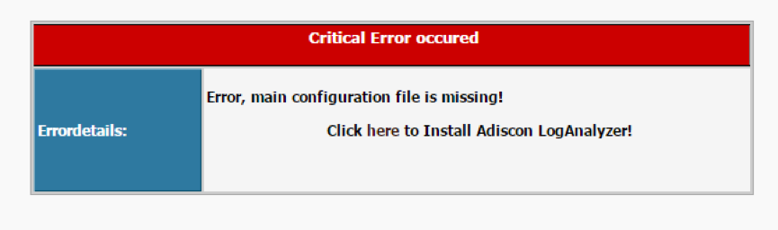
>提示没有配置文件，点击 here 利用向导生成。
2.	第一步，测试系统环境
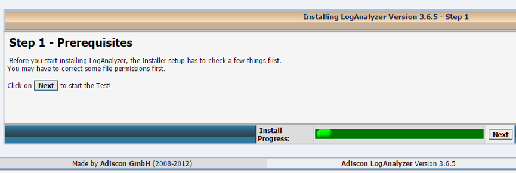
>点击 Next 进入下一步
3.	第二步，生成配置文件
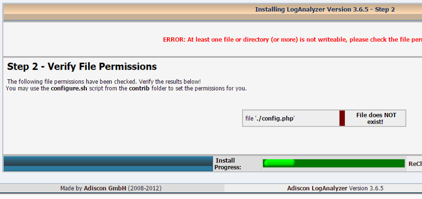
>提示错误：缺少config.php 文件，并且权限要设置为666
```
需要在/var/www/html/loganalyzer/ 下创建config.php 文件，并设置其权限为666。
# touch /var/www/html/loganalyzer/config.php
# chmod 666 /var/www/html/loganalyzer/config.php
```
>操作之后点击“ReCheck”，进入下一步
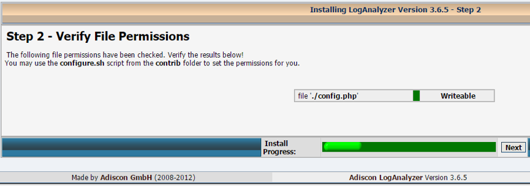
4.	第三步，基础配置
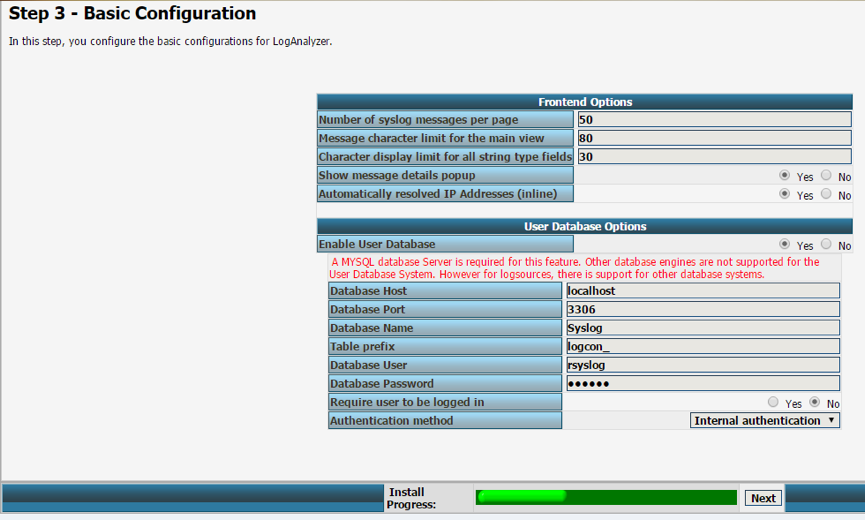
>在User Database Options 中，填入上面设置的参数，然后点击 Next.
5.	第四步，创建表
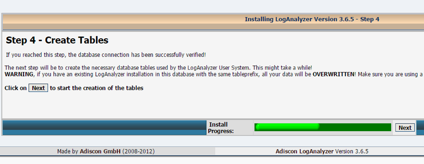
6.	第五步，检查SQL结果
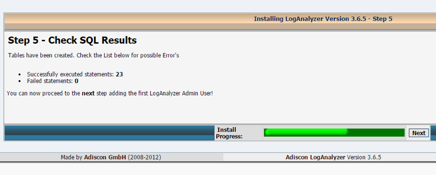
7.	第六步，创建管理账户
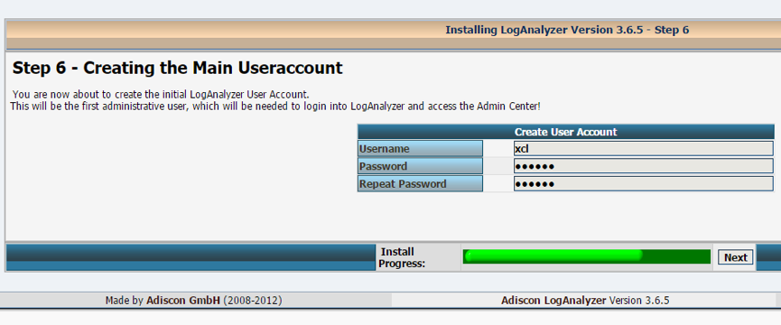
8.	第七步，创建系统日志
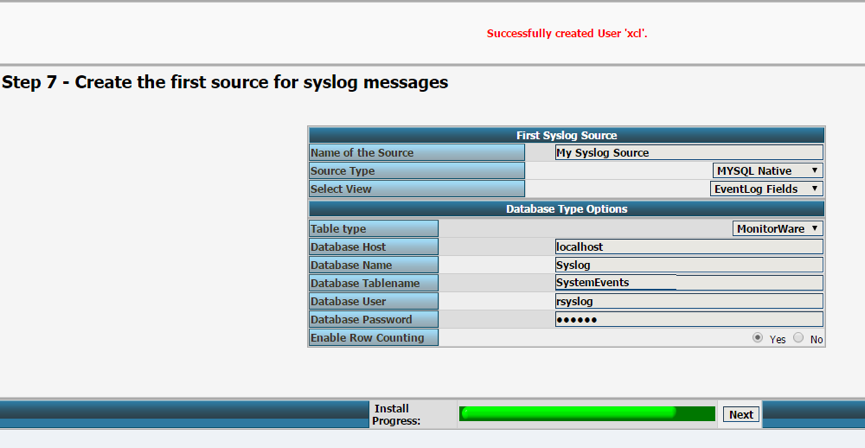
9.	第八步，完成
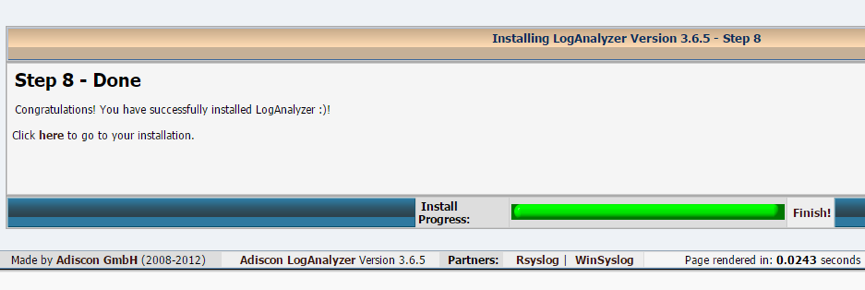

#### 测试
访问http://192.168.56.170/loganalyzer/index.php页面进行验证
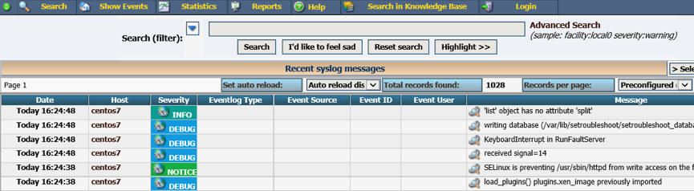
>这就是最后的结果，我们可以看到所有机器发来的日志

## 非syslog日志转发
有时候我们自己开发的应用程序，这样的日志不会通过rsyslog转发到服务器。但是现在我们想通过rsyslog统一的手机这些日志到服务器去分析，所以需要一些手段和自定义配置，主要是靠加载imfile模块来实现。
```
[root@localhost rsyslog.d]# pwd
/etc/rsyslog.d
[root@localhost rsyslog.d]# cat testlog.conf 
module(load="imfile"PollingInterval="5")
input(type="imfile"
File="/var/log/logtest"
Tag="testlogggg"
Severity="info"
StateFile="ssologs.log_state"
Facility="local5")
```
```
#systemctl restart rsyslog.service
```
```
[root@localhost rsyslog.d]# cat /root/test.sh 
#!/bin/bash 
for i in {1..100000};
do
echo $i >> /var/log/logtest
sleep 2
done
#bash /root/test.sh
```
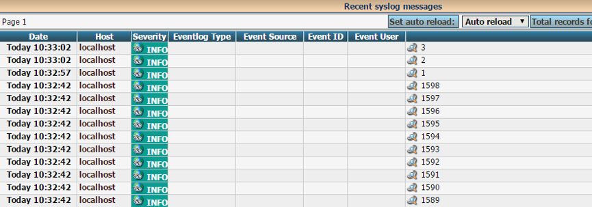

### 小结
以上我们完成了日志信息入库并在页面展示，其实这个页面很强大，可以过滤安全级别，过滤主机日志，查看统计信息等等….自己发掘吧。

### journalctl
在CentOS7的版本中，相对应的体现出systemd的日志，相对应我们需要了解systemd的日志条目，同时新加入的journalctl可以做日志查找等工作，所以我们还是要学习一下.

Systemd日志将日志数据存储在带有索引的结构化二进制文件中，此数据包含与日志事件相关的额外信息，例如，对于系统的日志事件，包含原始消息的设备和优先级。

通过journalctl命令从最旧的日志条目开始显示完整的系统日志
```
………………….
Oct 28 16:24:38 centos7.book setroubleshoot[5924]: Plugin Exception restorecon_source
Oct 28 16:24:38 centos7.book setroubleshoot[5924]: lookup_signature: found 0 matches with scores
Oct 28 16:24:38 centos7.book setroubleshoot[5924]: not in database yet
Oct 28 16:24:38 centos7.book setroubleshoot[5924]: sending alert to all clients
Oct 28 16:24:38 centos7.book setroubleshoot[5924]: SELinux is preventing /usr/sbin/httpd from 
…………………
```
Journalctl 命令以粗体文本突显优先级为notice或warning的消息，以红色文本突显优先级为error或更高级别的信息。
```
Journalctl –n 
//默认显示最后10行
Journalctl –n 5 
//显示5行
Journalctl –p err 
//列出优先级为err或以上的条目
//级别为：debug/info/notice/warning/err/crit/alert/emerg
Journalctl –f 
//显示最后10行，并进行监控实时输出记录，和tail –f类似
Journalctl –since today  
//显示当天所有日志条目
//支持yesterday/today/tomorrow
Journalctl –since “2015-10-21 20:21:00” –until “2015-10-25 12:00:00”
//输出时间段内的日志
Journalctl _PID=1  
//显示pid为1的进程日志
Journalctl _UID=0 
//显示源自用户0启动服务的所有systemd日志信息
Journalctl –since 9:00:00 _SYSTEM_UNIT=”httpd.service” 
//仅显示httpd，并且时间为当天早上9点以后的日志
```

### 永久存储
Systemd-journald 的日志是保存在内存中，可以将其设置保存在磁盘上，以便追溯。
默认情况下systemd日志保存在/run/log/journal中，意味着系统重新启动它会被清除。这是CentOS7的新机制，实际就是对于大多数系统来说，自上一次启动到现在运行的日志就足够了。
如果存放在/var/log/journal目录中，该日志会改为记录在这个目录中，这样做的优点就是可以启动后立即获得历史数据，然而并非所有数据都将永久保留。该日志具有一个内置的轮换机制，每月触发。
此外，默认情况下，日志的大小不能超过所处文件系统的10%，也不能造成文件系统的可用空间低于15%。这些值可以在/etc/system/journal.conf中调节。
```
[root@centos7 loganalyzer-3.6.5]# journalctl | head -2
-- Logs begin at Wed 2015-10-28 13:35:47 CST, end at Wed 2015-10-28 17:10:01 CST. --
Oct 28 13:35:47 localhost.localdomain systemd-journal[82]: Runtime journal is using 6.2M (max 49.6M, leaving 74.5M of free 490.4M, current limit 49.6M).
查看当前使用空间和总空间大小
```
用户以root身份创建/var/log/journal目录，使systemd日志变为永久日志
```
#mkdir /var/log/journal
```
确保/var/log/journal目录由root用户和systemd-journal所有，权限2755
```
#chown root:system-journal /var/log/journal
#chmod 2755 /var/log/journal
```
重新启动系统或者killall –USR1 system-journald

### 重要！时钟同步
#### 设置本地时钟和时区
在整体的日志收集和查看日志过程中，必须保证系统中的日志时间戳正确无误，对于多个系统间分析日志而言，正确同步系统时间非常重要。
通过NTP（网络时间协议）来解决这个问题。
1.	Timedatectl 命令可以显示当前时间信息和设置时间，如系统时间和NTP同步
```
[root@localhost ~]# timedatectl 
      Local time: Thu 2015-10-29 11:28:55 CST
  Universal time: Thu 2015-10-29 03:28:55 UTC
        RTC time: Thu 2015-10-29 03:28:58
        Timezone: Asia/Shanghai (CST, +0800)
     NTP enabled: yes
NTP synchronized: yes
 RTC in local TZ: no
      DST active: n/a
```
```
[root@localhost ~]# timedatectl list-timezones 
Africa/Abidjan
Africa/Accra
Africa/Addis_Ababa
……
```
```
[root@localhost ~]# timedatectl set-timezone Asia/Shanghai
[root@localhost ~]# timedatectl set-time 9:00:00
```
2.	设置NTP
CentOS7中采用chronyd服务配置NTP
```
[root@localhost ~]# timedatectl set-ntp true
[root@localhost ~]# vim /etc/chrony.conf
# Use public servers from the pool.ntp.org project.
# Please consider joining the pool (http://www.pool.ntp.org/join.html).
Server  centos7.com  iburst
[root@localhost ~]# systemctl restart chronyd
[root@localhost ~]# chronyc sources -v
210 Number of sources = 4

  .-- Source mode  '^' = server, '=' = peer, '#' = local clock.
 / .- Source state '*' = current synced, '+' = combined , '-' = not combined,
| /   '?' = unreachable, 'x' = time may be in error, '~' = time too variable.
||                                                 .- xxxx [ yyyy ] +/- zzzz
||                                                /   xxxx = adjusted offset,
||         Log2(Polling interval) -.             |    yyyy = measured offset,
||                                  \            |    zzzz = estimated error.
||                                   |           |                         
MS Name/IP address         Stratum Poll Reach LastRx Last sample
===============================================================================
^* centos7.com                 2   6    17    31    -12us[ +261us] +/-   25ms
```

## 总结
生产系统中，养成全局收取日志的系统，采用日志服务器加页面分析，或者是采用日志服务器加自己的过滤规则写成的应用软件
在新的版本中可以使用journalctl来查看系统信息，并且调教过滤效果比较好，对比老版本而言这是一个非常大的改进
高端一点的生产日志服务器会监控日志，主要思路就是：
收集日志，异步写入存储池，采用大数据或者其他方式进行实施分析。
